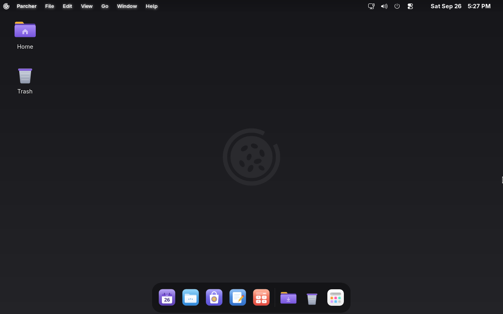
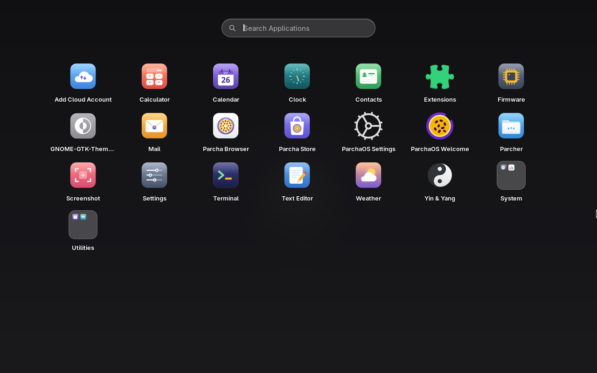
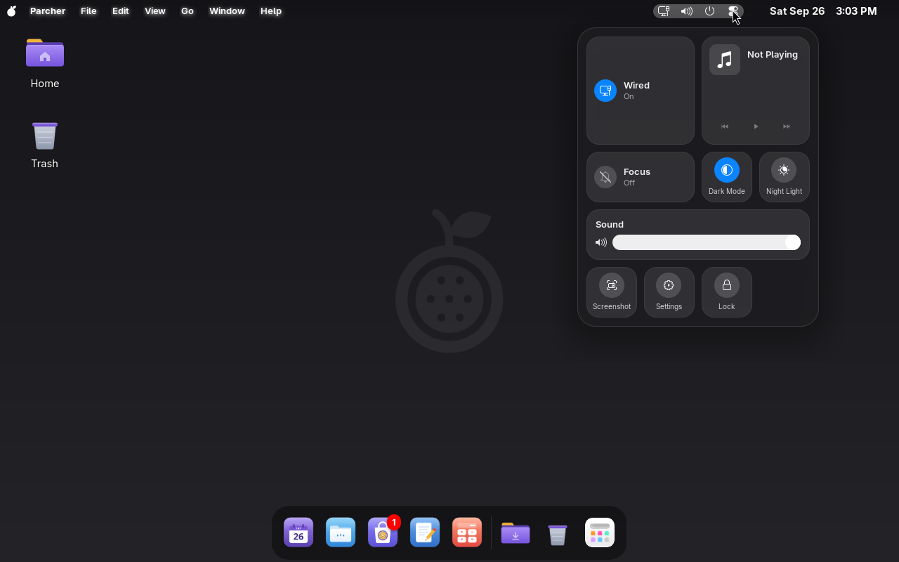
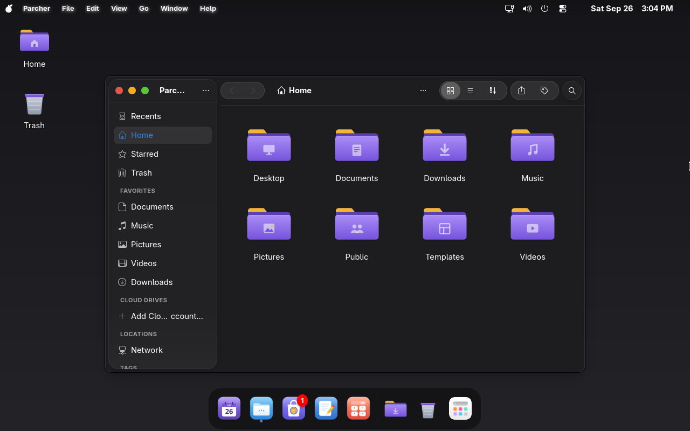

<p align="center">
  <picture>
    <source media="(prefers-color-scheme: dark)" srcset="branding/logo/parcha-logo-white.png">
    
  </picture>
</p>

<h1 align="center">ParchaOS</h1>

<p align="center">
  <strong>A polished, familiar desktop on a rock-solid Fedora base.</strong><br>
  Dock, global menu bar, full-screen launcher and a control center, set up and ready from the first boot.
</p>

<p align="center">
  <a href="https://github.com/Spanglish-Enterprises/parchaos-gnome/releases/latest"></a>
  <a href="https://parchaos-website.vercel.app"></a>
</p>

<p align="center">
  
  
  
  
</p>

<p align="center">
  
</p>

---

## Why ParchaOS

- **Everything where you expect it.** A dock with a magic-lamp minimize effect, a global
  menu bar, traffic-light window buttons and a full-screen app launcher,
  with no extension hunting or theme tweaking.
- **Fedora underneath.** Current kernels, Wayland, SELinux, Flatpak and the
  whole Fedora package collection. Updates arrive with a normal `dnf update`
  or from Parcha Store.
- **Its own look.** Original ParchaOS icons, light and dark themes, and two
  visual styles to pick from: **Glass** and **Classic**.
- **Ready on first boot.** A welcome assistant sets your style, light or
  dark, and how the Super key behaves, then gives a short tour.

## A closer look

<table>
  <tr>
    <td width="50%"></td>
    <td width="50%"></td>
  </tr>
  <tr>
    <td><b>Launcher</b>: every app on one screen, with search, folders,
    drag-to-arrange, and uninstall right from the launcher.</td>
    <td><b>Parcha Controls</b>: network, now playing, Focus, dark mode,
    Night Light and sound, one click from the menu bar.</td>
  </tr>
  <tr>
    <td colspan="2"></td>
  </tr>
  <tr>
    <td colspan="2"><b>Parcher</b>: a file manager with a sidebar, tags,
    cloud drives and quick sharing.</td>
  </tr>
</table>

## What's inside

| | |
|---|---|
| **Desktop** | Parcha Dock · global menu bar with an About card and weather · full-screen launcher · Parcha Controls · live Clock and Calendar icons · desktop icons · notifications in the top-right corner · optional video wallpaper |
| **Apps** | Parcher (files) · Parcha Browser (Chromium-based) · Parcha Store (apps and updates, Flathub included) · Preview · Mail · Clock · Weather · TMOG |
| **Comfort** | Session restore (your apps and windows come back after a restart) · scheduled Focus (Do Not Disturb) · automatic light/dark · Super-as-Ctrl shortcuts (optional) · system-wide ad blocking |
| **Look** | Glass and Classic styles · light and dark themes · original ParchaOS icons · ParchaOS boot splash and login screen |
| **Under the hood** | Fedora 44 · GNOME on Wayland · Btrfs · Secure Boot (Microsoft-signed shim) · a graphical installer |

## Get ParchaOS

1. **Download** the ISO from the
   [latest release](https://github.com/Spanglish-Enterprises/parchaos-gnome/releases/latest).
2. **Write it to a USB stick** (8 GB or larger) with
   [Fedora Media Writer](https://fedoraproject.org/workstation/download),
   [balenaEtcher](https://etcher.balena.io/) or `dd`.
3. **Boot from the stick.** You land in a live desktop where you can try
   everything first. Secure Boot can stay on.
4. **Click Install ParchaOS** in the dock and follow the steps. An install
   takes about five minutes.

**You'll need:** a 64-bit PC (UEFI or legacy BIOS), 4 GB of RAM (8 GB
recommended), and 25 GB of disk space.

**H.264 video:** like Fedora, the ISO doesn't include Cisco's OpenH264
library. It arrives with your first system update (`sudo dnf upgrade` or
Parcha Store), downloaded straight from Cisco.

> [!NOTE]
> ParchaOS is a young project. It's tested on real hardware and in virtual
> machines, but expect rough edges, and back up your data before you
> install. Known issues are listed in [SECURITY.md](SECURITY.md) and
> the [issue tracker](https://github.com/Spanglish-Enterprises/parchaos-gnome/issues).

## Build it yourself

The ISO is built from this repository on a Fedora 44 machine:

```sh
sudo ./engine/build-iso.sh --profile parchaos --clean-base --clean-target
```

The build takes about 35 minutes and writes the ISO to `build/`. ParchaOS's
own packages are in `packaging/` (one directory and spec per package) and
are published to the [COPR repository](https://copr.fedorainfracloud.org/coprs/alexgalicea/parchaos-gnome/)
that installed systems update from. For how things fit together, see
[docs/DEVELOPMENT.md](docs/DEVELOPMENT.md).

## Source code

Everything needed to rebuild ParchaOS is public:

- **ParchaOS's own packages:** this repository, plus the source RPMs on
  [COPR](https://copr.fedorainfracloud.org/coprs/alexgalicea/parchaos-gnome/).
- **Fedora packages** in the ISO: unmodified Fedora 44 builds, with
  sources at [src.fedoraproject.org](https://src.fedoraproject.org/) and
  as source RPMs (`dnf download --source <package>`).

If you can't get the source for any package in a ParchaOS release, open
an issue and we'll provide it, for at least three years after that
release.

## Contributing

Bug reports and ideas are welcome in
[Issues](https://github.com/Spanglish-Enterprises/parchaos-gnome/issues).
Please report security problems privately (see [SECURITY.md](SECURITY.md)).

## Credits

ParchaOS stands on the shoulders of:

- **[Fedora](https://fedoraproject.org)** and **[GNOME](https://www.gnome.org)**, the foundation.
- **[Pulsar OS "Bitten Fruit"](https://bittenfruit.inled.es/)** by Inled
  and **[pearOS](https://github.com/pearOS-archlinux)**, whose desktops inspired this one.
- **[MacTahoe](https://github.com/vinceliuice/MacTahoe-gtk-theme)** themes by
  vinceliuice, **Dash to Dock**, **xremap**, and the GNOME Shell extension
  authors credited in each package.
- The passion-fruit logo: "Passion Fruit" by LUTFI GANI AL ACHMAD from
  the Noun Project, CC BY 3.0 ([details](branding/logo/CREDITS.md)).

*Parcha* is a Spanish name for passion fruit, used in Puerto Rico and Venezuela.

## Trademarks

ParchaOS is an independent project. It isn't affiliated with or endorsed
by the Fedora Project, Red Hat, the GNOME Foundation, Apple, Inled
(Pulsar OS) or pearOS. Fedora is a trademark of Red Hat, LLC; GNOME is a
trademark of the GNOME Foundation; other names belong to their owners
and are used only to identify those projects.

## License

ParchaOS code, packaging and docs are licensed under
[GPL-3.0-or-later](LICENSE). Original artwork is licensed under
[CC BY-SA 4.0](LICENSE-ARTWORK). Third-party components keep their own
licenses, listed in each package's spec.
